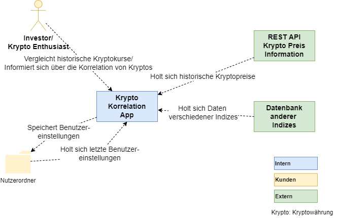
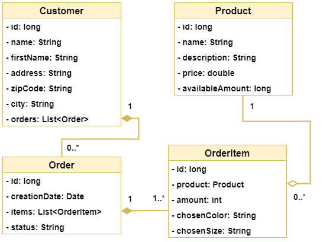
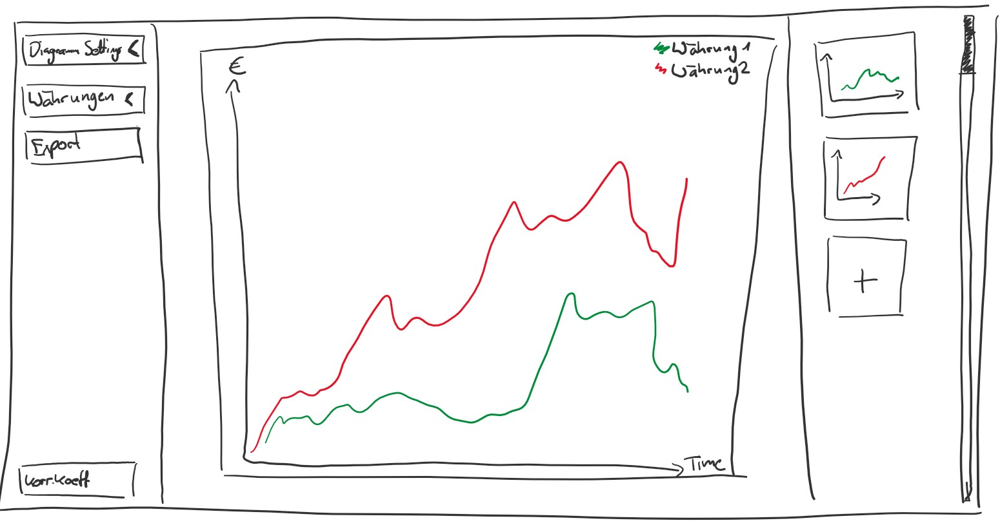
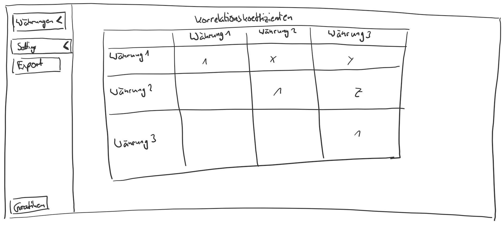

# Entwurf

> Dieser Entwurf legt die prinzipielle Lösungsarchitektur fest und enthält alles, was man benötigt, um einem Außenstehenden den prinzipiellen Aufbau der App erklären zu können.
> Der Fokus liegt auf einem groben Überblick und vereinzelten wichtigen Details (**keep it simple**).

**TODO:** Beschreibung des grundlegenden Aufbaus

**TODO:** Verweis auf Standards wie zum Beispiel verwendete Entwurfsmuster (optional)

## System Context Diagram



Investor/ Krypto Enthusiast: Kunde, der die App zur Informationbeschaffung über Kryptowährungen nutzt.
REST API Krypto Preis Informationen: Quelle der historischen Daten für Kryptowährungen.
DB Markt Indizes: Quelle der historischen Daten für Marktindizes.
Settings Folder: Speicherort für Benutzereinstellungen.

## Domain Model



**TODO:** Domain Model der zentralen Entitäten und deren Beziehungen erstellen

## Beschreibung der Java-Packages der API

Folgende Top-Level-Packages sind geplant während der Entwicklung zu nutzen:
```
api/
|- RESTController
|- database
|- statistic
|- export
|- Application.java
```
Im Package RESTController befinden sich die Controller der REST-API. Diese beinhaltet z.B. GET.
Das Package database kommuniziert mit der Datenbank und speichert die Daten, die persistent sein soll.
Das Package statistic beinhaltet mathematische Gleichungen, wie die Berechnung von Korrelationskoeffizienten.
Im Package export wird die Exportfunktion implementiert.

Im Falle von weiteren verwendeten Packages, die im Obrigen nicht genannt wurden, wird nach Definition of Done dieser Entwurf aktualisiert und hinzugefügt.


## Beschreibung der Frontend-Views

**TODO:** Auflistung der geplanten Frontend-Views mit kurzer Beschreibung

## GUI-Skizze: Home-View



**TODO:** Eigene möglichst handschriftliche GUI-Skizze erstellen und beschreiben

## GUI-Skizze: Ausgewählte wichtige Detail-View



**TODO:** Eigene möglichst handschriftliche GUI-Skizze erstellen und beschreiben
