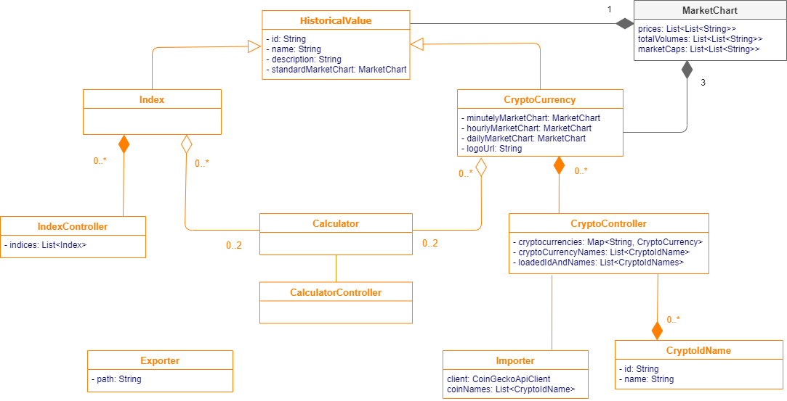

# Entwurf


## Grundlegender Aufbau
Der Nutzer möchte Zusammenhänge zwischen verschiedenen Kryptowährungen untersuchen. <br>
Die Software lädt beim Start standardmäßig den aktuellen Bitcoin- und Etheriumkurs und plottet diese beiden zusammen auf der Startseite in einem Diagramm. Der Nutzer hat die Möglichkeit, Kurse von verschiedenen Währungen zu laden und diese gegeneinander zu vergleichen. Für die Visualisierung kann er dazu mehrere Diagramme anlegen und unterschiedlich konfigurieren. Weitergehend ist es möglich, die Diagramme runterzuladen. <br>
In einer weiteren Ansicht kann der Nutzer die Korrelationskoeffizienten der einzelnen Kurse vergleichen. Dazu steht ihm eine Tabelle zur Verfügung, in welcher er beliebig (geladene) Kurse ein- und ausblenden kann und auch hier den Zeitraum, über welchen hinweg der Korrelationskoeffizient bestimmt wird, einstellen kann.


## System Context Diagram


Investor/ Krypto Enthusiast: Kunde, der die App zur Informationbeschaffung über Kryptowährungen nutzt.
REST API Krypto Preis Informationen: Quelle der historischen Daten für Kryptowährungen.
DB Markt Indizes: Quelle der historischen Daten für Marktindizes.
Settings Folder: Speicherort für Benutzereinstellungen.

## Domain Model



HistoricalValue/Index/CryptoCurrency: Kryptowährungen und Indizes. Kryptowährungen haben zusäthliche Attribute wie Handelsvolumen.

Calculator: berechnet Korrelation verschiedener Datensätze aus.

WebDataCollector: Sammelt die Daten der Kryptowährungen Indizes.

Importer/Exporter: Exportiert und importiert die Einstellungen des Nutzers.

## Beschreibung der Java-Packages der API
Die Java-Packages der API beschreiben nur das Backend der Application. Das Frontend liegt auf der gleichen Ebene wie der Ordner api.
Folgende Top-Level-Packages sind geplant während der Entwicklung zu nutzen:
```
api/
|- RESTController
|- database
|- statistic
|- values
|- export
|- Application.java
```
Im Package RESTController befinden sich die Controller der REST-API. Diese beinhaltet z.B. GET.
Das Package database kommuniziert mit der Datenbank und speichert die Daten, die persistent sein soll.
Das Package statistic beinhaltet mathematische Gleichungen, wie die Berechnung von Korrelationskoeffizienten.
Das Package values beinhaltet die derzeitigen Werte der Kryptowährungen und auch den Wert des Index.
Im Package export wird die Exportfunktion implementiert.

Im Falle von weiteren verwendeten Packages, die im Obrigen nicht genannt wurden, wird nach Definition of Done dieser Entwurf aktualisiert und hinzugefügt.


## Beschreibung der Frontend-Views


### Hauptansicht
- Beim Starten der Software ist ein Diagramm von Bitcoin und Etherium geladen
- Über "Währungen" in der Sidebar kann man aus allen verfügbaren Währungen auswählen, welche die Website laden soll
- Sidebar hat ein Diagramm-Settings Dropdown:
    - Einstellen des Betrachteten Zeitraums
    - Einstellen der Angezeigten Währungen
    - Einstellen ob EUR oder USD angezeigt wird
- Export Button erlaubt das Herunterladen des aktuell ausgewählten Diagramms
- Rechte Sidebar erlaubt, weitere Diagramme hinzuzufügen, Miniaturvorschau der Diagramme verfügbar
    - Einklappbar
- Über den "Korrelationskoeffizientenansicht" Button unten links kommt man in die Detailansicht der Korrelationskoeffizienten
  
### Korrelationsansicht
- Über "Währungen" lassen sich auch hier die geladenen Währungen auswählen
- In Settings findet man:
    - Auswählen der angezeigten Währungen
    - Auswählen des betrachteten Zeitraums
- Export erlaubt, die aktuell konfigurierte Tabelle runterzuladen
- Wenn man mit der Maus über einem bestimmten Feld hovert, kommt als Tooltipp eine textuelle Erklärung des Korrelationskoeffizienten
- Andere Ideen:
    - Hinzufügen und entfernen von Zeilen und Spalten direkt in Tabelle, ohne Settings in der Sidebar.


## GUI-Skizze: Home-View


## GUI-Skizze: Ausgewählte wichtige Detail-View


